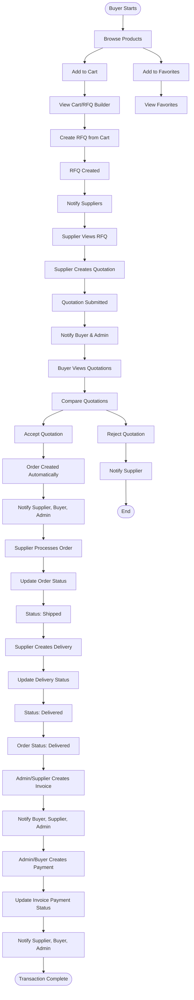

# B2B Medical Platform - Complete Workflow Documentation

## Overview

This document provides a comprehensive explanation of how the MedEquip B2B medical equipment platform works, covering all interactions between Suppliers, Buyers, and Admins throughout the complete procurement lifecycle from product discovery to delivery and payment.

---

## Table of Contents

1. [Product Discovery & Browsing](#1-product-discovery--browsing)
2. [Adding Products to Cart (RFQ Builder)](#2-adding-products-to-cart-rfq-builder)
3. [Adding Products to Favorites](#3-adding-products-to-favorites)
4. [Creating RFQ (Request for Quotation)](#4-creating-rfq-request-for-quotation)
5. [Supplier Response to RFQ](#5-supplier-response-to-rfq)
6. [Supplier Creates Quotation](#6-supplier-creates-quotation)
7. [Buyer Response to Quotations](#7-buyer-response-to-quotations)
8. [Order Management](#8-order-management)
9. [Invoice Management](#9-invoice-management)
10. [Payment Processing](#10-payment-processing)
11. [Delivery Management](#11-delivery-management)
12. [Admin Role in All Processes](#12-admin-role-in-all-processes)
13. [Complete Workflow Diagram](#13-complete-workflow-diagram)
14. [Database Relationships](#14-database-relationships)
15. [State Machines](#15-state-machines)
16. [Key Services](#16-key-services)

---

## 1. Product Discovery & Browsing

### How Buyers Discover Products

**Location:** `app/Http/Controllers/Web/Buyers/BuyerProductController.php::index()`

**Service:** `app/Services/BuyerProductService.php::browseProducts()`

**View:** `resources/views/buyer/products/index.blade.php`

**Process:**

1. **Buyer Access:**
   - Buyers navigate to `/buyer/products` to browse the product catalog
   - Products are displayed in a paginated grid layout

2. **Product Filtering:**
   The system supports comprehensive filtering:
   - **Category:** Hierarchical category selection (parent/child categories)
   - **Manufacturer:** Filter by manufacturer
   - **Price Range:** Min/max price filtering (based on supplier offers)
   - **Stock Status:** 
     - `in_stock` (stock_quantity > 0)
     - `low_stock` (stock_quantity 1-10)
     - `out_of_stock` (stock_quantity <= 0)
   - **Lead Time:** 
     - `fast` (<= 7 days)
     - `medium` (8-14 days)
     - `standard` (15-30 days)
     - `extended` (> 30 days)
   - **Search:** Searches across:
     - Product name, model, brand
     - Product description
     - SKU
     - Category names
     - Manufacturer names
     - Supplier company names

3. **Product Display Requirements:**
   Products shown must meet ALL criteria:
   - `is_active = true`
   - `review_status = 'approved'`
   - Have at least one verified supplier offering with `status = 'available'`
   - Supplier must be `is_verified = true` and `is_active = true`

4. **Product Sorting:**
   - By creation date (default)
   - By name (alphabetical)
   - By price (ascending/descending)
   - By number of suppliers

5. **Product Details:**
   When buyer clicks on a product:
   - Shows full product information
   - Lists all available suppliers with:
     - Price per supplier
     - Stock quantity
     - Lead time
     - Warranty
     - Value score (calculated based on price, lead time, warranty)
   - Highlights "best value" supplier
   - Shows related products from same category
   - Displays product images, specifications, features

**Key Code:**
```php
// BuyerProductService::browseProducts()
$query = Product::query()
    ->where('is_active', true)
    ->where('review_status', 'approved')
    ->withCount(['suppliers' => function ($q) {
        $q->where('product_supplier.status', 'available')
          ->where('suppliers.is_verified', true)
          ->where('suppliers.is_active', true);
    }]);
```

---

## 2. Adding Products to Cart (RFQ Builder)

### How Buyers Add Products to Cart

**Location:** `app/Http/Controllers/Web/Buyers/BuyerCartController.php::add()`

**Service:** `app/Services/RfqBuilderService.php`

**Models:** `app/Models/BuyerCart.php`, `app/Models/BuyerCartItem.php`

**Process:**

1. **Adding to Cart:**
   - Buyer clicks "Add to Cart" button on product page
   - System creates/retrieves active `BuyerCart` for the buyer
   - Creates `BuyerCartItem` record with:
     - `product_id` - The product being added
     - `quantity` - Required, between 1-10000
     - `specifications` - Optional custom specifications
     - `unit` - Unit of measurement (default: 'وحدة')
     - `supplier_id` - Optional preferred supplier
     - `max_price` - Optional maximum acceptable price

2. **Cart Validation:**
   - Product must be active and approved
   - Quantity must be between 1-10000
   - If supplier_id specified, that supplier must offer the product
   - If product already in cart with same supplier, quantity is incremented

3. **Cart Persistence:**
   - Cart is stored in database (not session-based)
   - Survives logout/login
   - Each buyer has one active cart
   - Cart expires after 30 days of inactivity

4. **Cart Features:**
   - Database-backed (persists across sessions)
   - Multiple products with different suppliers per item
   - Can specify custom specifications per item
   - Can set maximum acceptable price per item
   - Can save cart as template for future use
   - Can load saved templates into active cart

**Key Code:**
```php
// RfqBuilderService::addProduct()
$builder->items()->create([
    'product_id' => $product->id,
    'quantity' => $qty,
    'specifications' => $data['specifications'] ?? null,
    'unit' => $data['unit'] ?? 'وحدة',
    'supplier_id' => $supplierId,
    'max_price' => isset($data['max_price']) ? (float) $data['max_price'] : null,
]);
```

**Cart Management:**
- Update item: `BuyerCartController::update()`
- Remove item: `BuyerCartController::remove()`
- Clear cart: `BuyerCartController::clear()`
- View cart: `BuyerCartController::index()`

---

## 3. Adding Products to Favorites

### How Buyers Add Products to Favorites

**Location:** `app/Http/Controllers/Web/Buyers/BuyerProductController.php::toggleFavorite()`

**Service:** `app/Services/BuyerService.php::toggleFavorite()`

**Model:** `app/Models/BuyerFavorite.php` (pivot table: `buyer_product_favorites`)

**Process:**

1. **Toggle Favorite:**
   - Buyer clicks favorite icon (heart) on product page
   - System checks if product is already favorited
   - If favorited: Removes from favorites
   - If not favorited: Adds to favorites
   - Uses many-to-many relationship: `buyers` ↔ `products`

2. **Favorite Features:**
   - Toggle on/off functionality
   - Favorites persist across sessions
   - Buyers can view all favorites at `/buyer/products/favorites`
   - Can set price alerts on favorited products
   - Can set stock alerts on favorited products

3. **Price Alerts:**
   - Buyer can set target price for favorited product
   - System monitors price changes
   - Notifies buyer when price drops below target

4. **Stock Alerts:**
   - Buyer can set stock alert for favorited product
   - System monitors stock availability
   - Notifies buyer when product comes back in stock

**Key Code:**
```php
// BuyerService::toggleFavorite()
$existing = BuyerFavorite::where('buyer_id', $buyer->id)
    ->where('product_id', $productId)
    ->first();

if ($existing) {
    $existing->delete(); // Remove from favorites
} else {
    BuyerFavorite::create([
        'buyer_id' => $buyer->id,
        'product_id' => $productId,
    ]); // Add to favorites
}
```

**View Favorites:**
- Route: `/buyer/products/favorites`
- Controller: `BuyerProductController::favorites()`
- View: `resources/views/buyer/products/favorites.blade.php`

---

## 4. Creating RFQ (Request for Quotation)

### How Buyers Create RFQ

**Location:** `app/Http/Controllers/Web/Buyers/BuyerRfqController.php`

**Service:** `app/Services/RfqCreationService.php`

**Models:** `app/Models/Rfq.php`, `app/Models/RfqItem.php`

**Two Methods:**

### Method A: From Cart/RFQ Builder

**Process:**

1. **Cart Checkout:**
   - Buyer adds products to cart
   - Buyer navigates to cart page (`/buyer/cart`)
   - Buyer clicks "Create RFQ" or "Checkout"

2. **RFQ Details Form:**
   - Buyer fills RFQ metadata:
     - **Title:** Required, max 200 characters
     - **Description:** Optional, max 5000 characters
     - **Deadline:** Optional date (must be in future)
     - **Public/Private:** 
       - Public: Visible to all verified suppliers
       - Private: Only visible to assigned suppliers
     - **Status:** `'draft'` or `'open'`
     - **Save as Template:** Optional, with template name

3. **RFQ Creation:**
   - System validates all cart items are still valid
   - Creates `Rfq` record:
     - `buyer_id` - Auto-set from authenticated user
     - `reference_code` - Auto-generated: `RFQ-YYYYMMDD-XXXX`
     - `status` - Based on is_public: public → 'open', private → 'draft'
   - Creates `RfqItem` records for each cart item:
     - Links to product (if product exists)
     - Preserves quantity, specifications, unit
     - Preserves preferred_supplier_id and max_price from cart

4. **Supplier Notifications:**
   - If RFQ is public AND status is 'open':
     - System notifies all verified suppliers
     - Uses `RfqWorkflowService::notifyNewRfq()`

5. **Cart Cleanup:**
   - If saved as template: Cart marked as template, kept
   - Otherwise: Cart items deleted, cart remains for future use

### Method B: Direct RFQ Creation

**Process:**

1. **Manual RFQ Creation:**
   - Buyer navigates to `/buyer/rfqs/create`
   - Buyer manually adds RFQ items:
     - Can select from existing products
     - Can enter custom items (without product reference)
   - Each item requires:
     - Item name (required)
     - Quantity (required, min 1)
     - Unit (default: 'وحدة')
     - Specifications (optional)
     - Product ID (optional - for linking to catalog)

2. **Advanced Features:**
   - **CSV Import:** Buyer can import items from CSV file
   - **Templates:** Buyer can load saved RFQ templates
   - **Duplicate:** Buyer can duplicate existing RFQ
   - **Budget Estimation:** System estimates budget range based on supplier prices
   - **Supplier Suggestions:** System suggests suppliers based on RFQ items
   - **Deadline Suggestion:** System suggests deadline based on lead times

3. **RFQ Submission:**
   - System validates at least one item exists
   - Creates RFQ and RfqItem records
   - If public + open: Notifies suppliers
   - Logs activity

**Key Features:**

- **RFQ Visibility:**
  - Public RFQs: Visible to all verified suppliers
  - Private RFQs: Only visible to assigned suppliers
  - Suppliers can see RFQs they've quoted on

- **RFQ Items:**
  - Can reference existing products (links to catalog)
  - Can be custom items (no product reference)
  - Each item can have preferred supplier
  - Each item can have maximum price constraint

- **RFQ Status Flow:**
  - `draft` → `open` → `closed` / `awarded` / `cancelled`
  - RFQ automatically closes when deadline passes
  - RFQ status changes to `awarded` when quotation accepted

**Key Code:**
```php
// RfqCreationService::createFromBuilder()
$rfq = Rfq::create([
    'buyer_id' => $builder->buyer_id,
    'title' => $metadata['title'],
    'reference_code' => ReferenceCodeService::generateUnique(...),
    'status' => $metadata['status'] ?? 'draft',
    'is_public' => $metadata['is_public'] ?? true,
]);

foreach ($cartItems as $cartItem) {
    RfqItem::create([
        'rfq_id' => $rfq->id,
        'product_id' => $cartItem->product_id,
        'quantity' => $cartItem->quantity,
        'preferred_supplier_id' => $cartItem->supplier_id,
        'max_price' => $cartItem->max_price,
    ]);
}
```

**Key Files:**
- Controller: `app/Http/Controllers/Web/Buyers/BuyerRfqController.php`
- Service: `app/Services/RfqCreationService.php`
- Builder Service: `app/Services/RfqBuilderService.php`
- Workflow Service: `app/Services/RfqWorkflowService.php`

---

## 5. Supplier Response to RFQ

### How Suppliers View and Respond to RFQs

**Location:** `app/Http/Controllers/Web/Suppliers/SupplierRfqController.php`

**Service:** `app/Services/RfqWorkflowService.php`

**Process:**

1. **RFQ Visibility:**
   Suppliers see RFQs at `/supplier/rfqs` that meet these criteria:
   - Public RFQs with status `'open'`
   - Private RFQs assigned to them (via `rfq_supplier` pivot)
   - RFQs they've already quoted on

2. **RFQ Viewing:**
   - Supplier clicks on RFQ to view details
   - System loads:
     - RFQ information (title, description, deadline)
     - All RFQ items with specifications
     - Buyer information
     - Existing quotations (if any)
   - System marks RFQ as "viewed" in `rfq_supplier` pivot table
   - Updates `viewed_at` timestamp

3. **Quotation Creation:**
   - Supplier clicks "Submit Quotation" button
   - System validates:
     - RFQ status is `'open'`
     - RFQ deadline hasn't passed
     - Supplier hasn't already quoted
   - Supplier fills quotation form (see Section 6)

4. **Quotation Submission:**
   - System creates quotation in `'draft'` status
   - System immediately submits (draft → pending) using `QuotationWorkflowService`
   - Updates `rfq_supplier` pivot status to `'quoted'`
   - Notifies buyer and admin

**Key Features:**

- **RFQ Filtering:**
  - Filter by status (open, closed, cancelled)
  - Search by title, reference code, description
  - Filter by date range
  - Filter by buyer

- **Quotation Management:**
  - Suppliers can only submit one quotation per RFQ
  - Quotations can be edited if RFQ is still open
  - Quotations can be deleted if status is `'pending'`
  - System prevents duplicate quotations (unique constraint)

**Key Code:**
```php
// SupplierRfqController::index()
$query = Rfq::availableFor($supplier->id)
    ->with(['buyer', 'items', 'quotations' => function ($q) use ($supplier) {
        $q->where('supplier_id', $supplier->id);
    }]);
```

**Key Files:**
- Controller: `app/Http/Controllers/Web/Suppliers/SupplierRfqController.php`
- Model: `app/Models/Rfq.php` (scope: `availableFor()`)

---

## 6. Supplier Creates Quotation

### Detailed Quotation Creation Process

**Location:** `app/Http/Controllers/Web/Suppliers/SupplierRfqController.php::storeQuote()`

**Service:** `app/Services/QuotationWorkflowService.php::submitQuotation()`

**Request:** `app/Http/Requests/Suppliers/SupplierQuotationRequest.php`

**Process:**

1. **Quotation Form:**
   - Supplier selects RFQ and clicks "Create Quotation"
   - System displays quotation form with:
     - All RFQ items listed
     - For each item: fields for unit price, lead time, warranty, notes
     - Total price field (auto-calculated or manual)
     - Terms and conditions textarea
     - Valid until date
     - Optional document attachments

2. **Validation:**
   System validates:
   - RFQ status is `'open'`
   - RFQ deadline hasn't passed
   - Supplier hasn't already quoted (unique constraint)
   - All required fields are provided
   - Unit prices are numeric and positive
   - Total price matches sum of item prices

3. **Quotation Creation:**
   - System creates `Quotation` record:
     - `rfq_id` - Links to RFQ
     - `supplier_id` - Auto-set from authenticated supplier
     - `reference_code` - Auto-generated: `QUO-YYYYMMDD-XXXX`
     - `status` - Initially `'draft'`
     - `total_price` - Calculated from items or manual
     - `terms` - Payment and delivery terms
     - `valid_until` - Quotation validity date

4. **Quotation Items:**
   - System creates `QuotationItem` records for each RFQ item:
     - Links to `rfq_item_id`
     - Links to `product_id` (if RFQ item has product)
     - `item_name` - From RFQ item or product name
     - `quantity` - From RFQ item
     - `unit_price` - Supplier's price per unit
     - `total_price` - unit_price × quantity
     - `lead_time` - Supplier's lead time
     - `warranty` - Supplier's warranty terms
     - `notes` - Optional supplier notes

5. **Quotation Submission:**
   - System submits quotation using `QuotationWorkflowService::submitQuotation()`
   - Status transitions: `'draft'` → `'pending'`
   - Validates RFQ can still accept quotations
   - Checks for duplicate quotations

6. **Notifications:**
   - Buyer receives notification about new quotation
   - Admin receives notification
   - Supplier receives confirmation

7. **Attachments:**
   - Supplier can upload documents (PDF, images)
   - Stored using Spatie MediaLibrary
   - Attached to quotation record

**Key Code:**
```php
// SupplierRfqController::storeQuote()
$quotation = Quotation::create([
    'rfq_id' => $rfq->id,
    'supplier_id' => $supplier->id,
    'reference_code' => ReferenceCodeService::generateUnique('QUO', Quotation::class),
    'total_price' => $totalPrice,
    'status' => 'draft',
]);

// Create items
foreach ($items as $item) {
    QuotationItem::create([
        'quotation_id' => $quotation->id,
        'rfq_item_id' => $rfqItem->id,
        'unit_price' => $item['unit_price'],
        'total_price' => $item['unit_price'] * $rfqItem->quantity,
        'lead_time' => $item['lead_time'] ?? null,
        'warranty' => $item['warranty'] ?? null,
    ]);
}

// Submit quotation (draft → pending)
$quotation = $workflowService->submitQuotation($quotation);
```

**Quotation Editing:**
- Suppliers can edit quotations if:
  - RFQ status is still `'open'`
  - RFQ deadline hasn't passed
  - Quotation status is `'pending'`
- Editing resets quotation status to `'pending'`
- Notifies buyer and admin of update

**Key Files:**
- Controller: `app/Http/Controllers/Web/Suppliers/SupplierRfqController.php`
- Service: `app/Services/QuotationWorkflowService.php`
- Models: `app/Models/Quotation.php`, `app/Models/QuotationItem.php`

---

## 7. Buyer Response to Quotations

### How Buyers Evaluate and Respond to Quotations

**Location:** `app/Http/Controllers/Web/Buyers/BuyerQuotationController.php`

**Service:** `app/Services/QuotationWorkflowService.php`

**Process:**

### Viewing Quotations

1. **Quotation List:**
   - Buyers view quotations at `/buyer/quotations`
   - Quotations grouped by RFQ
   - Can filter by:
     - Status (pending, accepted, rejected)
     - RFQ
     - Supplier
     - Date range

2. **Quotation Scoring:**
   System calculates quotation scores based on:
   - **Price Competitiveness:** Lower price = higher score
   - **Supplier Rating:** Historical performance
   - **Lead Time:** Shorter lead time = higher score
   - **Warranty Terms:** Better warranty = higher score
   - **Historical Performance:** Past order success rate

### Comparing Quotations

1. **Side-by-Side Comparison:**
   - Buyer can compare multiple quotations for same RFQ
   - System highlights "best value" quotation
   - Comparison shows:
     - Total price
     - Per-item pricing breakdown
     - Lead times per item
     - Warranty terms per item
     - Supplier information and rating
     - Score and score breakdown

2. **Sorting Options:**
   - By price (ascending/descending)
   - By date (newest/oldest)
   - By supplier name
   - By score (best value first)

### Accepting Quotation

1. **Acceptance Process:**
   - Buyer clicks "Accept" on chosen quotation
   - System validates using `QuotationWorkflowService::acceptQuotation()`:
     - RFQ is locked (prevents race conditions)
     - RFQ status allows acceptance
     - No other quotation already accepted
     - Quotation status is `'pending'`

2. **State Transitions:**
   - Quotation: `'pending'` → `'accepted'`
   - Other quotations: `'pending'` → `'rejected'` (auto-rejected)
   - RFQ: `'open'` → `'awarded'`
   - RFQ `awarded_quotation_id` set to accepted quotation

3. **Order Creation (Automatic):**
   - System automatically creates `Order` from accepted quotation
   - Creates `OrderItem` records from `QuotationItem` records
   - Order number: `ORD-YYYYMMDD-XXXXXX`
   - Order status: `'pending'`
   - Order links to quotation, buyer, supplier

4. **Notifications:**
   - Supplier receives order notification
   - Admin receives notification
   - Buyer receives confirmation email
   - Rejected suppliers receive rejection notification

### Rejecting Quotation

1. **Rejection Process:**
   - Buyer clicks "Reject" on quotation
   - Buyer can provide rejection reason (optional)
   - System updates quotation status: `'pending'` → `'rejected'`
   - Sets `rejected_by` and `rejected_at`
   - Stores rejection reason

2. **Notifications:**
   - Supplier receives rejection notification with reason
   - Admin receives notification

**Key Code:**
```php
// BuyerQuotationController::accept()
$quotation = $workflowService->acceptQuotation($quotation, Auth::user());

// Creates order automatically
$order = $this->createOrderFromQuotation($quotation, $buyer);
```

**Order Creation Details:**
```php
// BuyerQuotationController::createOrderFromQuotation()
$order = Order::create([
    'quotation_id' => $quotation->id,
    'buyer_id' => $buyer->id,
    'supplier_id' => $quotation->supplier_id,
    'order_number' => ReferenceCodeService::generateUnique(...),
    'status' => 'pending',
    'total_amount' => $quotation->total_price,
]);

// Create order items from quotation items
foreach ($quotation->items as $quotationItem) {
    OrderItem::create([
        'order_id' => $order->id,
        'product_id' => $quotationItem->product_id,
        'quantity' => $quotationItem->quantity,
        'unit_price' => $quotationItem->unit_price,
        'total_price' => $quotationItem->total_price,
    ]);
}
```

**Key Files:**
- Controller: `app/Http/Controllers/Web/Buyers/BuyerQuotationController.php`
- Service: `app/Services/QuotationWorkflowService.php`
- Model: `app/Models/Quotation.php` (scoring methods)

---

## 8. Order Management

### How Buyers Get Their Orders

**Location:** `app/Http/Controllers/Web/Buyers/BuyerOrderController.php`

**Service:** `app/Services/BuyerOrderService.php`

**Model:** `app/Models/Order.php`

**Process:**

### Order Creation

1. **Automatic Creation:**
   - Order is automatically created when buyer accepts quotation
   - No manual order creation by buyers
   - Order inherits all data from quotation

2. **Order Details:**
   - Order number: `ORD-YYYYMMDD-XXXXXX` (auto-generated)
   - Order date: Current timestamp
   - Status: `'pending'` (initial)
   - Total amount: From quotation total price
   - Currency: Default LYD (Libyan Dinar)
   - Links to: quotation, buyer, supplier

3. **Order Items:**
   - Created from quotation items
   - Includes: product, quantity, unit price, total price
   - Preserves lead time and warranty from quotation

### Order Viewing

1. **Order List:**
   - Buyers view orders at `/buyer/orders`
   - Can filter by:
     - Status (pending, processing, shipped, delivered, cancelled)
     - Date range
     - Supplier
     - Search by order number

2. **Order Details:**
   - Shows complete order information
   - Lists all order items with details
   - Shows order status history
   - Shows related invoices
   - Shows delivery information
   - Shows payment information

### Order Status Flow

**Status Transitions:**
- `pending` → `processing` → `shipped` → `delivered`
- Can be `cancelled` at any point before `delivered`

**Status Updates:**
- Supplier updates order status
- Buyer receives notification at each status change
- Order status affects delivery creation eligibility

**Status Details:**
- **Pending:** Order created, awaiting supplier processing
- **Processing:** Supplier is preparing order
- **Shipped:** Order has been shipped (delivery can be created)
- **Delivered:** Order delivered and confirmed
- **Cancelled:** Order cancelled (final state)

### Re-ordering

1. **Re-order to Cart:**
   - Buyer can add order items to cart/RFQ builder
   - System adds items to active cart
   - Buyer can modify before creating new RFQ

2. **Re-order to RFQ:**
   - Buyer can create new RFQ from previous order
   - System creates RFQ with order items
   - Buyer can modify before submitting

**Key Code:**
```php
// BuyerOrderService::reorderToBuilder()
foreach ($order->items as $orderItem) {
    if ($orderItem->product && $orderItem->product->is_active) {
        $builderService->addProduct($cart, $orderItem->product, [
            'quantity' => $orderItem->quantity,
            'specifications' => $orderItem->specifications,
        ]);
    }
}
```

**Key Files:**
- Controller: `app/Http/Controllers/Web/Buyers/BuyerOrderController.php`
- Service: `app/Services/BuyerOrderService.php`
- Model: `app/Models/Order.php`

---

## 9. Invoice Management

### How Suppliers Send Invoices

**Location:** `app/Http/Controllers/Web/InvoiceController.php`

**Supplier Controller:** `app/Http/Controllers/Web/Suppliers/SupplierInvoiceController.php`

**Model:** `app/Models/Invoice.php`

**Process:**

### Invoice Creation

1. **Who Can Create:**
   - Admin can create invoices for any order
   - Supplier can create invoices for their orders (if implemented)

2. **Invoice Details:**
   - Invoice number: `INV-YYYYMMDD-XXXXX` (auto-generated)
   - Invoice date: Current date
   - Links to order
   - Includes:
     - All order items
     - Subtotal (sum of item prices)
     - Tax amount (if applicable)
     - Discount amount (if applicable)
     - Total amount (subtotal + tax - discount)
     - Payment terms
     - Notes

3. **Invoice Status:**
   - Initial status: `'issued'`
   - Can be approved: `'issued'` → `'approved'`
   - Can be cancelled: `'issued'` → `'cancelled'`

4. **Payment Status:**
   - Initial: `'unpaid'`
   - Updates automatically when payments are recorded:
     - If total paid >= invoice total → `'paid'`
     - If total paid > 0 → `'partial'`
     - Otherwise → `'unpaid'`

### Invoice Viewing

1. **Supplier View:**
   - Suppliers view invoices at `/supplier/invoices`
   - Can filter by:
     - Status (issued, approved, cancelled)
     - Payment status (paid, unpaid, partial)
     - Date range
     - Order number
   - Can download invoice as PDF
   - Can export invoices to Excel

2. **Invoice Details:**
   - Shows complete invoice information
   - Lists all invoice items
   - Shows payment history
   - Shows remaining balance
   - Can download as PDF

### Invoice Approval

1. **Admin Approval:**
   - Admin can approve invoices
   - Status: `'issued'` → `'approved'`
   - Approved invoices are final

**Key Code:**
```php
// InvoiceController::store()
$invoice = Invoice::create([
    'order_id' => $request->order_id,
    'invoice_number' => ReferenceCodeService::generateUnique(...),
    'subtotal' => $request->subtotal,
    'tax' => $request->tax ?? 0,
    'discount' => $request->discount ?? 0,
    'total_amount' => $request->total_amount,
    'status' => 'issued',
    'payment_status' => 'unpaid',
]);
```

**Key Files:**
- Controller: `app/Http/Controllers/Web/InvoiceController.php`
- Supplier Controller: `app/Http/Controllers/Web/Suppliers/SupplierInvoiceController.php`
- Model: `app/Models/Invoice.php`

---

## 10. Payment Processing

### How Suppliers Get Payments

**Location:** `app/Http/Controllers/Web/PaymentController.php`

**Supplier Controller:** `app/Http/Controllers/Web/Suppliers/SupplierPaymentController.php`

**Model:** `app/Models/Payment.php`

**Process:**

### Payment Creation

1. **Who Can Create:**
   - Admin can create payment records
   - Buyer can create payment records (if implemented)

2. **Payment Details:**
   - Payment reference: `PAY-YYYYMMDD-XXXXX` (auto-generated)
   - Links to invoice and/or order
   - Amount: Payment amount
   - Currency: LYD, USD, or EUR (default: LYD)
   - Payment method:
     - Bank transfer
     - Credit card
     - Cash
     - Check
   - Transaction ID: Optional bank transaction reference
   - Receipt attachments: Optional proof of payment
   - Paid at: Payment date

3. **Auto-Sync:**
   - System automatically syncs `buyer_id` and `supplier_id` from order
   - Maintains denormalized data for reporting performance
   - Ensures data integrity

### Payment Status

**Status Flow:**
- `pending` → `completed` / `failed` / `refunded`

**Status Details:**
- **Pending:** Payment recorded, awaiting confirmation
- **Completed:** Payment confirmed and processed
- **Failed:** Payment failed or rejected
- **Refunded:** Payment refunded to buyer

### Invoice Payment Status Update

**Automatic Update:**
When payment is created/updated:
1. System calculates total paid for invoice
2. Compares with invoice total amount
3. Updates invoice payment status:
   - If total paid >= invoice total → `'paid'`
   - If total paid > 0 → `'partial'`
   - Otherwise → `'unpaid'`

**Key Code:**
```php
// PaymentController::store()
$payment = Payment::create([
    'invoice_id' => $request->invoice_id,
    'order_id' => $request->order_id,
    'amount' => $request->amount,
    'currency' => $request->currency ?? 'LYD',
    'method' => $request->method,
    'status' => 'pending',
]);

// Auto-update invoice payment status
$totalPaid = $payment->invoice->payments()->sum('amount');
if ($totalPaid >= $invoiceTotal) {
    $payment->invoice->update(['payment_status' => 'paid']);
} elseif ($totalPaid > 0) {
    $payment->invoice->update(['payment_status' => 'partial']);
}
```

### Payment Viewing

1. **Supplier View:**
   - Suppliers view payments at `/supplier/payments`
   - Can filter by:
     - Status (pending, completed, failed, refunded)
     - Payment method
     - Currency
     - Date range
     - Order/invoice number
   - Can view payment details with receipts

2. **Payment Details:**
   - Shows complete payment information
   - Shows related invoice/order
   - Shows payment receipts (if uploaded)
   - Shows payment history

**Key Files:**
- Controller: `app/Http/Controllers/Web/PaymentController.php`
- Supplier Controller: `app/Http/Controllers/Web/Suppliers/SupplierPaymentController.php`
- Model: `app/Models/Payment.php`

---

## 11. Delivery Management

### How Buyers Get Orders Delivered

**Location:** `app/Http/Controllers/Web/Suppliers/SupplierDeliveryController.php`

**Model:** `app/Models/Delivery.php`

**Process:**

### Delivery Creation

1. **Prerequisites:**
   - Order status must be `'shipped'`
   - Only one delivery per order (enforced)

2. **Delivery Creation:**
   - Supplier navigates to order details
   - Supplier clicks "Create Delivery"
   - Supplier fills delivery form:
     - **Delivery Date:** When delivery will occur
     - **Delivery Location:** Address or location
     - **Receiver Name:** Person receiving delivery
     - **Receiver Phone:** Contact number
     - **Notes:** Optional delivery notes

3. **Delivery Record:**
   - Delivery number: `DLV-XXXXXXXX` (auto-generated)
   - Status: `'in_transit'` (initial)
   - Links to: order, supplier, buyer
   - Created by: Supplier user

### Delivery Status Flow

**Status Transitions:**
- `pending` → `in_transit` → `delivered` / `failed`

**Status Updates:**
- Supplier updates delivery status as delivery progresses
- Status changes trigger notifications

**Status Details:**
- **Pending:** Delivery record created, awaiting processing
- **In Transit:** Delivery is on the way
- **Delivered:** Delivery completed and confirmed
- **Failed:** Delivery attempt failed

### Delivery Confirmation

1. **When Status Changes to 'Delivered':**
   - Order status automatically updates to `'delivered'`
   - Buyer receives delivery confirmation notification
   - Admin receives notification
   - Delivery `verified_at` timestamp set

2. **Delivery Proof:**
   - Supplier can upload delivery proof documents
   - Proof stored using Spatie MediaLibrary
   - Admin can verify delivery with proof
   - Proof can include: photos, signatures, receipts

3. **Delivery Verification:**
   - Admin can verify deliveries
   - Sets `is_verified = true`
   - Sets `verified_by` and `verified_at`

### Buyer Viewing

1. **Order Details:**
   - Buyers see delivery information in order details
   - Shows delivery status
   - Shows delivery date and location
   - Shows receiver information
   - Shows delivery proof (if available)

2. **Notifications:**
   - Buyer receives notification when delivery created
   - Buyer receives notification on status updates
   - Buyer receives confirmation when delivered

**Key Code:**
```php
// SupplierDeliveryController::store()
$delivery = Delivery::create([
    'order_id' => $order->id,
    'supplier_id' => $supplier->id,
    'buyer_id' => $order->buyer_id,
    'delivery_number' => ReferenceCodeService::generateUnique(...),
    'status' => Delivery::STATUS_IN_TRANSIT,
    'delivery_date' => $validated['delivery_date'],
]);

// When delivered, update order status
if ($newStatus === Delivery::STATUS_DELIVERED) {
    $delivery->order->update(['status' => Order::STATUS_DELIVERED]);
}
```

**Key Files:**
- Controller: `app/Http/Controllers/Web/Suppliers/SupplierDeliveryController.php`
- Model: `app/Models/Delivery.php`

---

## 12. Admin Role in All Processes

### Admin Oversight and Management

**Location:** Various admin controllers

### Product Management

**Location:** `app/Http/Controllers/Web/AdminProductRequestController.php`

**Responsibilities:**

1. **Product Requests Review:**
   - Admins review supplier product requests at `/admin/product-requests`
   - Can approve: Creates new Product from ProductRequest
   - Can merge: Links ProductRequest to existing Product
   - Can reject: Marks ProductRequest as rejected with reason
   - All actions notify supplier

2. **Product Catalog Management:**
   - Admins manage canonical product catalog
   - Can approve/reject products
   - Can edit product information
   - Can manage categories and manufacturers
   - Can deactivate products

### RFQ Management

**Location:** `app/Http/Controllers/Web/AdminRfqController.php`

**Capabilities:**

1. **RFQ Monitoring:**
   - View all RFQs (buyers' and suppliers')
   - Monitor RFQ activity and statistics
   - View RFQ details and quotations

2. **RFQ Management:**
   - Assign suppliers to private RFQs
   - Close/cancel RFQs
   - View RFQ statistics and analytics
   - Export RFQ data

### Quotation Management

**Location:** `app/Http/Controllers/Web/AdminQuotationController.php`

**Capabilities:**

1. **Quotation Monitoring:**
   - View all quotations across all RFQs
   - Monitor quotation activity
   - View quotation statistics
   - Compare quotations

2. **Quotation Management:**
   - View quotation details
   - Export quotations to Excel
   - Monitor quotation acceptance rates

### Order Management

**Location:** `app/Http/Controllers/Web/OrderController.php`

**Capabilities:**

1. **Order Oversight:**
   - View all orders (system-wide)
   - Filter by buyer, supplier, status, date
   - View order statistics and analytics

2. **Order Management:**
   - Update order status
   - Cancel orders
   - View order details
   - Export orders to Excel

### Invoice Management

**Location:** `app/Http/Controllers/Web/InvoiceController.php`

**Capabilities:**

1. **Invoice Creation:**
   - Create invoices for any order
   - Set tax, discount, payment terms

2. **Invoice Approval:**
   - Approve invoices (status: `'issued'` → `'approved'`)
   - Cancel invoices if needed

3. **Invoice Monitoring:**
   - View all invoices
   - Monitor payment status
   - Download invoices as PDF
   - Export invoices to Excel

### Payment Management

**Location:** `app/Http/Controllers/Web/PaymentController.php`

**Capabilities:**

1. **Payment Recording:**
   - Create payment records for any invoice/order
   - Update payment status
   - Attach payment receipts

2. **Payment Monitoring:**
   - View all payments
   - Monitor payment status
   - Track payment methods and currencies
   - Export payments to Excel

### Delivery Management

**Location:** `app/Http/Controllers/Web/DeliveryController.php`

**Capabilities:**

1. **Delivery Monitoring:**
   - View all deliveries
   - Monitor delivery status
   - View delivery statistics

2. **Delivery Verification:**
   - Verify deliveries
   - Review delivery proof
   - Update delivery status
   - Resolve delivery disputes

### User Management

**Location:** `app/Http/Controllers/Web/UserController.php`, `app/Http/Controllers/Web/SupplierController.php`, `app/Http/Controllers/Web/BuyerController.php`

**Capabilities:**

1. **Registration Approval:**
   - Approve/reject supplier registrations
   - Approve/reject buyer registrations
   - Set verification status
   - Manage user accounts

2. **User Management:**
   - Create/edit/delete users
   - Assign roles and permissions
   - Manage user profiles
   - View user activity

### System Management

**Location:** Various admin controllers

**Capabilities:**

1. **System Settings:**
   - Manage system settings
   - Configure platform parameters
   - Manage system preferences

2. **Activity Logs:**
   - View comprehensive activity logs
   - Filter by user, date, event, model
   - Track all system changes
   - Audit trail for compliance

3. **Notifications:**
   - Send system-wide notifications
   - Manage notification templates
   - View notification statistics

4. **Reports & Analytics:**
   - Generate system-wide reports
   - View analytics and statistics
   - Export data to Excel/PDF
   - Monitor platform performance

**Key Admin Routes:**
- `/admin/products` - Product management
- `/admin/product-requests` - Product request review
- `/admin/rfqs` - RFQ monitoring
- `/admin/quotations` - Quotation monitoring
- `/admin/orders` - Order management
- `/admin/invoices` - Invoice management
- `/admin/payments` - Payment management
- `/admin/deliveries` - Delivery management
- `/admin/users` - User management
- `/admin/suppliers` - Supplier management
- `/admin/buyers` - Buyer management

---

## 13. Complete Workflow Diagram



---

## 14. Database Relationships

### Core Entity Relationships

**Products ↔ Suppliers:**
- Many-to-many via `product_supplier` pivot table
- Pivot includes: price, stock_quantity, lead_time, warranty, status, notes

**Buyers → RFQs:**
- One-to-many: One buyer can create many RFQs
- `rfqs.buyer_id` → `buyers.id`

**RFQs → RfqItems:**
- One-to-many: One RFQ has many items
- `rfq_items.rfq_id` → `rfqs.id`

**RFQs → Quotations:**
- One-to-many: One RFQ can have many quotations
- `quotations.rfq_id` → `rfqs.id`

**Quotations → QuotationItems:**
- One-to-many: One quotation has many items
- `quotation_items.quotation_id` → `quotations.id`

**Quotations → Orders:**
- One-to-one: One quotation creates one order
- `orders.quotation_id` → `quotations.id`

**Orders → OrderItems:**
- One-to-many: One order has many items
- `order_items.order_id` → `orders.id`

**Orders → Invoices:**
- One-to-many: One order can have multiple invoices
- `invoices.order_id` → `orders.id`

**Orders → Payments:**
- One-to-many: One order can have multiple payments
- `payments.order_id` → `orders.id`

**Orders → Deliveries:**
- One-to-many: One order can have multiple deliveries
- `deliveries.order_id` → `orders.id`

**Buyers ↔ Products (Favorites):**
- Many-to-many via `buyer_product_favorites` pivot table
- Simple relationship for favorites

**Buyers → BuyerCarts → BuyerCartItems:**
- One-to-many-to-many: Buyer has carts, carts have items
- `buyer_carts.buyer_id` → `buyers.id`
- `buyer_cart_items.cart_id` → `buyer_carts.id`

**RFQs ↔ Suppliers (Assignments):**
- Many-to-many via `rfq_supplier` pivot table
- Pivot includes: status, invited_at, viewed_at, notes

---

## 15. State Machines

### RFQ State Machine

**States:**
- `draft` - RFQ being prepared
- `open` - RFQ accepting quotations
- `under_review` - RFQ being evaluated
- `closed` - RFQ closed (deadline passed or manually closed)
- `awarded` - RFQ awarded to a quotation
- `cancelled` - RFQ cancelled

**Transitions:**
- `draft` → `open` (when published)
- `open` → `closed` (deadline passed or manually closed)
- `open` → `awarded` (when quotation accepted)
- `open` → `cancelled` (manually cancelled)
- `under_review` → `awarded` / `closed` / `cancelled`

**Service:** `app/Services/RfqStateMachine.php`

### Quotation State Machine

**States:**
- `draft` - Quotation being prepared
- `pending` - Quotation submitted, awaiting buyer decision
- `accepted` - Quotation accepted by buyer
- `rejected` - Quotation rejected by buyer
- `expired` - Quotation expired (past valid_until or RFQ closed)
- `withdrawn` - Quotation withdrawn by supplier

**Transitions:**
- `draft` → `pending` (when submitted)
- `pending` → `accepted` (when buyer accepts)
- `pending` → `rejected` (when buyer rejects)
- `pending` → `expired` (automatic when deadline passes)
- `pending` → `withdrawn` (when supplier withdraws)

**Service:** `app/Services/QuotationStateMachine.php`

### Order State Machine

**States:**
- `pending` - Order created, awaiting processing
- `processing` - Order being prepared by supplier
- `shipped` - Order shipped (delivery can be created)
- `delivered` - Order delivered and confirmed
- `cancelled` - Order cancelled

**Transitions:**
- `pending` → `processing` (supplier starts processing)
- `pending` → `cancelled` (buyer or admin cancels)
- `processing` → `shipped` (supplier ships order)
- `processing` → `cancelled` (cancelled during processing)
- `shipped` → `delivered` (delivery confirmed)
- `delivered` - Final state (no further transitions)
- `cancelled` - Final state (no further transitions)

### Invoice State Machine

**States:**
- `issued` - Invoice created
- `approved` - Invoice approved by admin
- `cancelled` - Invoice cancelled

**Payment Status (separate from invoice status):**
- `unpaid` - No payments received
- `partial` - Partial payment received
- `paid` - Fully paid

**Transitions:**
- `issued` → `approved` (admin approval)
- `issued` → `cancelled` (admin cancellation)
- Payment status updates automatically based on payment records

### Delivery State Machine

**States:**
- `pending` - Delivery record created
- `in_transit` - Delivery in progress
- `delivered` - Delivery completed
- `failed` - Delivery attempt failed

**Transitions:**
- `pending` → `in_transit` (delivery starts)
- `in_transit` → `delivered` (delivery completed)
- `in_transit` → `failed` (delivery failed)
- `delivered` - Final state
- `failed` - Final state

---

## 16. Key Services

### 1. RfqBuilderService
**Location:** `app/Services/RfqBuilderService.php`

**Responsibilities:**
- Manages cart/RFQ builder functionality
- Add/update/remove items from builder
- Validate builder items
- Save/load templates
- Get builder summary

**Key Methods:**
- `getOrCreateBuilder()` - Get or create active cart
- `addProduct()` - Add product to builder
- `updateItem()` - Update builder item
- `removeItem()` - Remove item from builder
- `clearBuilder()` - Clear all items
- `validateBuilder()` - Validate all items
- `getBuilderSummary()` - Get builder summary with validation
- `saveAsTemplate()` - Save builder as template
- `loadTemplate()` - Load template into active builder

### 2. RfqCreationService
**Location:** `app/Services/RfqCreationService.php`

**Responsibilities:**
- Converts cart/builder to RFQ
- Creates RFQ and RfqItem records
- Handles template saving
- Notifies suppliers

**Key Methods:**
- `createFromBuilder()` - Create RFQ from cart
- `notifySuppliers()` - Notify suppliers about new RFQ

### 3. RfqWorkflowService
**Location:** `app/Services/RfqWorkflowService.php`

**Responsibilities:**
- Manages RFQ state transitions
- Handles RFQ closing (deadline passed)
- Sends deadline reminders
- Validates RFQ can accept quotations
- Notifies suppliers about new RFQs

**Key Methods:**
- `closeExpiredRfqs()` - Close RFQs past deadline
- `sendDeadlineReminders()` - Send reminders
- `canAcceptQuotations()` - Validate RFQ can accept quotations
- `notifyNewRfq()` - Notify suppliers

### 4. QuotationWorkflowService
**Location:** `app/Services/QuotationWorkflowService.php`

**Responsibilities:**
- Manages quotation state transitions
- Handles quotation acceptance with locking
- Auto-rejects other quotations when one accepted
- Expires quotations
- Notifies buyers and suppliers

**Key Methods:**
- `submitQuotation()` - Submit quotation (draft → pending)
- `acceptQuotation()` - Accept quotation with RFQ locking
- `rejectQuotation()` - Reject quotation
- `expireQuotations()` - Expire past-due quotations

### 5. BuyerProductService
**Location:** `app/Services/BuyerProductService.php`

**Responsibilities:**
- Handles product browsing and filtering
- Applies filters (category, price, stock, lead time)
- Applies sorting
- Gets product details with suppliers
- Calculates value scores

**Key Methods:**
- `browseProducts()` - Browse products with filters
- `getProductDetails()` - Get product details for show page
- `getRelatedProducts()` - Get related products by category

### 6. BuyerOrderService
**Location:** `app/Services/BuyerOrderService.php`

**Responsibilities:**
- Manages buyer order operations
- Gets orders with filters
- Gets order statistics
- Handles re-ordering (to cart or RFQ)

**Key Methods:**
- `getOrders()` - Get buyer's orders
- `getOrderStats()` - Get order statistics
- `reorderToBuilder()` - Add order items to cart
- `reorderToRfq()` - Create RFQ from order

### 7. NotificationService
**Location:** `app/Services/NotificationService.php`

**Responsibilities:**
- Centralized notification dispatch
- Sends notifications to users
- Notifies all admins
- Handles notification types and icons

**Key Methods:**
- `send()` - Send notification to user(s)
- `notifyAdmins()` - Notify all admins
- `notifySuppliers()` - Notify all suppliers
- `notifyBuyers()` - Notify all buyers

### 8. ReferenceCodeService
**Location:** `app/Services/ReferenceCodeService.php`

**Responsibilities:**
- Generates unique reference codes
- Ensures uniqueness across entities
- Supports different prefixes

**Key Methods:**
- `generateUnique()` - Generate unique reference code
- Supports prefixes: RFQ, QUO, ORD, INV, PAY, DLV

---

## Complete Transaction Flow

### End-to-End Example

**Scenario: Buyer purchases medical equipment**

1. **Product Discovery:**
   - Buyer browses products at `/buyer/products`
   - Filters by category: "X-Ray Machines"
   - Finds product: "Digital X-Ray System"

2. **Add to Cart:**
   - Buyer clicks "Add to Cart"
   - Sets quantity: 2 units
   - Selects preferred supplier
   - Sets max price: 50,000 LYD

3. **Create RFQ:**
   - Buyer goes to cart
   - Clicks "Create RFQ"
   - Fills: Title, Description, Deadline (7 days)
   - Submits RFQ
   - System creates RFQ-20260127-ABCD

4. **Supplier Response:**
   - Supplier receives notification
   - Supplier views RFQ
   - Supplier creates quotation:
     - Unit price: 48,000 LYD
     - Lead time: 14 days
     - Warranty: 2 years
   - Submits quotation
   - System creates QUO-20260127-EFGH

5. **Buyer Evaluation:**
   - Buyer receives notification
   - Buyer views quotation
   - Buyer compares with other quotations
   - Buyer accepts quotation

6. **Order Creation:**
   - System automatically creates ORD-20260127-IJKL
   - Order status: `pending`
   - Notifies supplier, buyer, admin

7. **Order Processing:**
   - Supplier updates status to `processing`
   - Buyer receives notification
   - Supplier prepares order

8. **Shipping:**
   - Supplier updates status to `shipped`
   - Buyer receives notification
   - Supplier creates delivery record DLV-12345678

9. **Delivery:**
   - Supplier updates delivery status to `in_transit`
   - Supplier updates to `delivered`
   - Order status auto-updates to `delivered`
   - Buyer receives confirmation

10. **Invoicing:**
    - Admin creates invoice INV-20260127-MNOP
    - Invoice total: 96,000 LYD
    - Notifies buyer and supplier

11. **Payment:**
    - Buyer creates payment PAY-20260127-QRST
    - Amount: 96,000 LYD
    - Method: Bank transfer
    - Invoice payment status updates to `paid`
    - Supplier receives payment notification

12. **Completion:**
    - Order: `delivered`
    - Invoice: `paid`
    - Delivery: `delivered`
    - Transaction complete

---

## Notification Summary

All major actions trigger notifications to relevant parties:

| Action | Notifies |
|--------|----------|
| RFQ Created (public) | All verified suppliers |
| Quotation Submitted | Buyer, Admin |
| Quotation Accepted | Supplier, Admin, Rejected suppliers |
| Quotation Rejected | Supplier |
| Order Created | Supplier, Buyer, Admin |
| Order Status Updated | Buyer |
| Invoice Created | Buyer, Supplier, Admin |
| Payment Created | Supplier, Buyer, Admin |
| Delivery Created | Buyer, Admin |
| Delivery Status Updated | Buyer |
| Delivery Delivered | Buyer, Admin |

---

## Security & Permissions

### Route Protection

All routes protected by:
- **Authentication:** User must be logged in
- **Role-Based Access:** User must have appropriate role
- **Permission Middleware:** Granular permission checks

### Key Permissions

**Products:**
- `products.view` - View products
- `products.create` - Create products
- `products.approve` - Approve products
- `products.reject` - Reject products

**RFQs:**
- `rfqs.view` - View RFQs
- `rfqs.create` - Create RFQs
- `rfqs.update` - Update RFQs
- `rfqs.delete` - Delete RFQs

**Quotations:**
- `quotations.view` - View quotations
- `quotations.create` - Create quotations
- `quotations.accept` - Accept quotations
- `quotations.reject` - Reject quotations

**Orders:**
- `orders.view` - View orders
- `orders.create` - Create orders
- `orders.update` - Update orders

**Invoices:**
- `invoices.view` - View invoices
- `invoices.create` - Create invoices
- `invoices.approve` - Approve invoices

**Payments:**
- `payments.view` - View payments
- `payments.create` - Create payments

**Deliveries:**
- `deliveries.view` - View deliveries
- `deliveries.create` - Create deliveries
- `deliveries.verify` - Verify deliveries

---

## Data Integrity

### Financial Precision

- All financial columns use `decimal(15,2)` precision
- Prevents floating-point errors
- Ensures accurate calculations

### Referential Integrity

- Financial records use `RESTRICT` on delete
- Prevents accidental data loss
- Maintains audit trail

### Transaction Safety

- Critical operations wrapped in database transactions
- Rollback on errors
- Ensures data consistency

---

## Conclusion

This B2B medical equipment platform provides a complete end-to-end procurement workflow from product discovery through delivery and payment. The system ensures:

- **Transparency:** All actions logged and auditable
- **Efficiency:** Automated workflows reduce manual work
- **Security:** Role-based access control throughout
- **Reliability:** Transaction safety and data integrity
- **User Experience:** Intuitive interfaces for all user types

All processes are interconnected, with automatic notifications, state management, and comprehensive audit trails ensuring a smooth and transparent B2B transaction experience.
